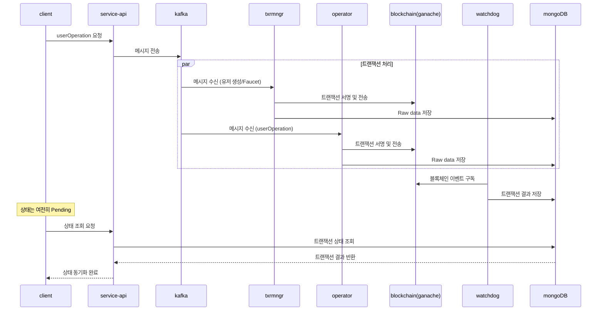
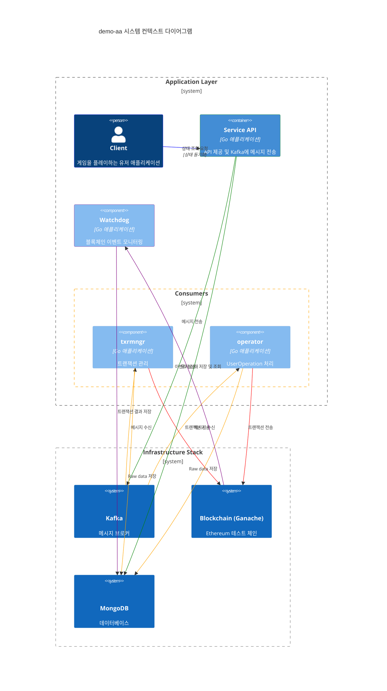

# demo-aa
Account Abstraction 기반의 계정으로 Gamble을 할 수 있습니다.

`gamble`

- 가위바위보
- 0부터 9까지 숫자 맞추기 게임

## 기술 스택
다음과 같은 기술 스택을 사용하여 단일 WSL2 환경에 microK8s로 배포

- `go (version 1.23 이상)`  fiber 프레임워크 사용
- `account abstraction` [eth-infinitism samples](https://github.com/eth-infinitism/account-abstraction/tree/develop/contracts/samples)
- `microK8s`
- `ganache`
- `mongoDB`
- `kafka`
- `grafana, loki, promtail` stdout으로 출력되는 로그를 수집하고 시각화


## 애플리케이션
`cmd` 디렉토리 6가지 애플리케이션.

- `setup` : 컨트랙트 세트를 배포하고 MongoDB에 저장. Kafka 토픽을 생성. (초기 설정 시 1회 실행)
- `watchdog` : 컨트랙트 세트의 이벤트 로그를 감시하여 이벤트 로그와 트랜잭션을 DB에 저장합니다.
- `txrmngr` : 유저 생성과 Faucet 트랜잭션을 서명하고 전송하는 Consumer입니다.
- `operator` : UserOperation 트랜잭션을 서명하고 전송하는 Consumer입니다.
- `service` : 유저에게 API를 제공하며, Kafka 토픽에 메시지를 생산(Produce)합니다.
- `client` : 유저가 사용하는 클라이언트 애플리케이션입니다.


## 시퀀스 다이어그램
유저가 `client`를 통해 `userOperation`을 전송하면, `service` API를 통해 Kafka의 토픽에 메시지가 전송.

- `txrmngr`와 `operator`는 트랜잭션들을 모아서 서명하고 `sendTransaction`을 통해 블록체인에 전송하며, DB에 요청 사항을 기록.
- `watchdog`은 지속적으로 블록체인을 구독하며 트랜잭션 처리 결과를 DB에 기록. 유저는 `userOperation` 실행 시 `user` DB에 트랜잭션이 `pending` 상태임을 업데이트하며, 이후 조회 시점에 `consumer`와 `watchdog`을 통해 기록된 트랜잭션 상태를 확인하고 동기화.
- 조회를 하기 전까지는 `pending` 상태이며, 이 상태에서는 유저가 다음 `userOperation`을 전송할 수 없음. 조회 이후부터 유저의 상태는 동기화.



<!--
### 다이어그램

-->

## 실행 방법

### Docker 설치

```bash
sudo apt-get update -y

sudo apt-get install ca-certificates curl
sudo install -m 0755 -d /etc/apt/keyrings
sudo curl -fsSL https://download.docker.com/linux/ubuntu/gpg -o /etc/apt/keyrings/docker.asc
sudo chmod a+r /etc/apt/keyrings/docker.asc

echo \
  "deb [arch=$(dpkg --print-architecture) signed-by=/etc/apt/keyrings/docker.asc] https://download.docker.com/linux/ubuntu \
  $(. /etc/os-release && echo "$VERSION_CODENAME") stable" | \
  sudo tee /etc/apt/sources.list.d/docker.list > /dev/null

sudo apt-get install -y docker-ce docker-ce-cli containerd.io docker-buildx-plugin docker-compose-plugin

sudo usermod -aG docker $USER
sudo systemctl start docker
sudo systemctl enable docker
```

### MicroK8s 설치
> 참고: [MicroK8s 설치 문서](https://microk8s.io/docs/install-wsl2) & [MicroK8s registry](https://microk8s.io/docs/registry-built-in)

```bash
sudo swapoff -a

sudo snap install microk8s --classic
sudo snap alias microk8s.kubectl kubectl
sudo microk8s start

microk8s enable dns hostpath-storage rbac metrics-server ingress
microk8s enable registry:size=40Gi
```

### Namespace, ConfigMap, Stack 배포

```bash
kubectl apply -f ./.microk8s/namespace.yaml
kubectl apply -f ./.microk8s/configmap.yaml
kubectl apply -f ./.microk8s/dp_stack.yaml
kubectl apply -f ./.microk8s/svc_stack.yaml
kubectl apply -f ./.microk8s/ingress.yaml
```

### Setup 실행

```bash
cd cmd/setup
go run .
```

- 로컬에서 `setup`을 실행하는 경우 추가 작업

```bash
kubectl edit daemonset nginx-ingress-microk8s-controller -n ingress
```

`spec.template.spec.containers.args.ports`에 다음을 추가.

```yaml
...
        - containerPort: 8000
          hostPort: 8000
          name: mongo
          protocol: TCP
        - containerPort: 8100
          hostPort: 8100
          name: ganache
          protocol: TCP
        - containerPort: 8101
          hostPort: 8101
          name: ganache2
          protocol: TCP
        - containerPort: 8200
          hostPort: 8200
          name: kafka
          protocol: TCP
...
```

### Docker 이미지 빌드 및 registry에 푸시

```bash
docker build --build-arg CMD_PATH=txrmngr -t localhost:32000/txrmngr:latest .
docker build --build-arg CMD_PATH=operator -t localhost:32000/operator:latest .
docker build --build-arg CMD_PATH=watchdog -t localhost:32000/watchdog:latest .
docker build --build-arg CMD_PATH=service -t localhost:32000/service:latest .

docker push localhost:32000/txrmngr:latest
docker push localhost:32000/operator:latest
docker push localhost:32000/watchdog:latest
docker push localhost:32000/service:latest
```

### 애플리케이션 배포

```bash
kubectl apply -f ./.microk8s/dp_app.yaml
kubectl apply -f ./.microk8s/svc_app.yaml
kubectl apply -f ./.microk8s/hpas.yaml
```

### 로그 수집 (옵션)

로그 수집을 원할 경우 다음을 실행합니다:

```bash
kubectl apply -f ./.microk8s/loki/configmap.yaml
kubectl apply -f ./.microk8s/loki/loki.yaml
kubectl apply -f ./.microk8s/loki/rbac.yaml
kubectl apply -f ./.microk8s/loki/promtail.yaml
kubectl apply -f ./.microk8s/loki/grafana.yaml
```

### Client 테스트

- 테스트 전에 최상단에 `URL`과 `privateKeyHex`를 알맞게 수정한 후 진행합니다.

```bash
cd cmd/client
go run .
```

정상 실행시 아래와 같이 출력

```
demo-client 'exit' to quit

type: 'login' or 'join'
```

1. `join`을 입력하여 `userid`, `password`로 회원가입
```
> join
your id: foo
your password: bar
```
2. 다시 `login`을 입력하여 접속
```
> login
your id: foo
your password: bar
```

3. 원하는 동작 선택

```
type: 'state' or 'faucet' or 'transfer' or 'gamble'
```

- `state`: 현재 내 계정의 상태를 확인합니다.
- `faucet`: 토큰을 지급받습니다.
- `transfer`: 토큰을 전송합니다.
- `gamble`: Gamble 게임을 진행합니다.

1. 먼저 `faucet`을 입력한 후 `state`를 입력하여 `accountBalance`가 증가했는지 확인합니다.
2. 토큰이 지급되었다면 `gamble`을 입력하고, `1`을 선택하여 가위바위보 게임을 진행합니다.
   - `1`(바위), `2`(보), `3`(가위) 중 원하는 선택을 합니다.
   - 게임 후 `state`를 통해 ERC-1155 토큰이 지급되었는지 확인할 수 있습니다.
3. 가위바위보 보상은 `1000`번 토큰, 0~9 숫자 맞추기는 `2000`번 토큰이 지급됩니다.
4. `gamble` 입력 후 `3`(exchange)을 선택하면 ERC-1155 토큰을 ERC-20 토큰으로 교환할 수 있습니다.


---

감사합니다.
